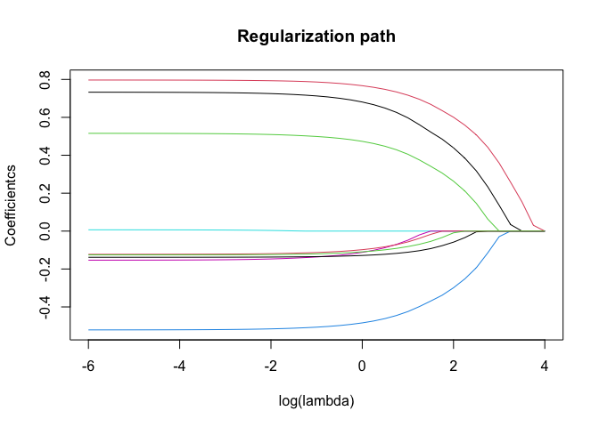
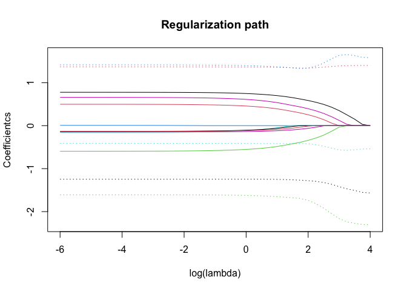
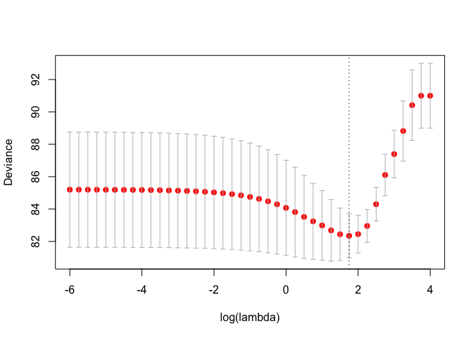
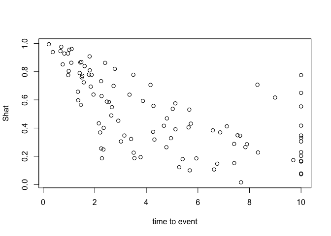

# regsurv

<!-- badges: start -->
<!-- badges: end -->

The goal of **regsurv** is to aid in parametric survival model
development in settings where regularization is required. It provides
access to flexible log hazard and log cumulative hazard modeling based
where the baseline (cumulative) hazard is modeled by means of restricted
cubic splines. The main functions for data preparation, model fitting,
cross-validation, and prediction are illustrated is this document. First
of all however, let’s install the package.

## Installation

You can install the development version of **regsurv** from
[GitHub](https://github.com/) with:

``` r
# install.packages("devtools")
devtools::install_github("jeroenhoogland/regsurv")
```

## Example

Documentation is available for all functions and can be accessed using
`?` followed by the function name. For instance, `?regsurv` will provide
the documentation for the `regurv()` function.

A basic analysis example follows below:

``` r
library(regsurv) # load the package

head(simdata) # tte data with 9 covariates
#>   id  eventtime status         x1          x2          x3         x4
#> 1  1  0.9613914      1 -0.6264538  0.13622189  0.07730312 -1.4546914
#> 2  2  5.2742237      1  0.1836433  0.40716760 -0.29686864 -0.8456543
#> 3  3 10.0000000      0 -0.8356286 -0.06965481 -1.18324224 -1.2504797
#> 4  4  2.6667278      1  1.5952808 -0.24766434  0.01129269  0.6672881
#> 5  5  0.2201874      1  0.3295078  0.69555081  0.99160104 -1.2907697
#> 6  6  2.3345753      1 -0.8204684  1.14622836  1.59396745 -2.0350035
#>            x5          x6         x7          x8          x9
#> 1  1.13496509  0.06526642  0.8500435  0.25313781 -0.88614959
#> 2  1.11193185  1.03532642 -0.9253130  0.01149799 -1.92225490
#> 3 -0.87077763  2.26021579  0.8935812 -1.97578396  1.61970074
#> 4  0.21073159  1.31469628 -0.9410097 -0.42632672  0.51926990
#> 5  0.06939565 -0.87002335  0.5389521  0.61230256 -0.05584993
#> 6 -1.66264885 -0.50313004 -0.1819744  1.23081411  0.69641761
simdata <- simdata[1:100, ] # 100 cases

# prepare the data for model fitting
prep <- survprep(tte=simdata$eventtime,
                 delta=simdata$status,
                 X=as.matrix(simdata[ ,grep("x", names(simdata))]),
                 model.scale="loghazard",
                 time.scale="logtime",
                 spline.type="rcs",
                 ntimebasis=4,
                 qpoints=9)
```

Note that the covariate data argument required matrix format. The
argument `ntimebasis` specifies the number of basis columns for the
restricted cubic spline, and the `qpoints` specifies the number of
quadrature points for the Gauss-Legendre numerical integration required
to evaluate the log-likelihood.

Among other things, `survprep()` creates the model matrix (scaled by
default), which can be viewed using

``` r
head(prep$mm$d) # columns of the model matrix (scaled by default)
#>   int      basis1    basis2      basis3     basis4         x1          x2
#> 1   1 -0.03937364 0.2234748 0.000000000 0.00000000 -0.6264538  0.13622189
#> 2   1  1.66283150 2.2361864 0.102974713 0.01459886  0.1836433  0.40716760
#> 3   1  2.30258509 3.7686726 0.341972242 0.09622914 -0.8356286 -0.06965481
#> 4   1  0.98085219 1.0828761 0.006637081 0.00000000  1.5952808 -0.24766434
#> 5   1 -1.51327611 0.0000000 0.000000000 0.00000000  0.3295078  0.69555081
#> 6   1  0.84783000 0.9186898 0.002361127 0.00000000 -0.8204684  1.14622836
#>            x3         x4          x5          x6         x7          x8
#> 1  0.07730312 -1.4546914  1.13496509  0.06526642  0.8500435  0.25313781
#> 2 -0.29686864 -0.8456543  1.11193185  1.03532642 -0.9253130  0.01149799
#> 3 -1.18324224 -1.2504797 -0.87077763  2.26021579  0.8935812 -1.97578396
#> 4  0.01129269  0.6672881  0.21073159  1.31469628 -0.9410097 -0.42632672
#> 5  0.99160104 -1.2907697  0.06939565 -0.87002335  0.5389521  0.61230256
#> 6  1.59396745 -2.0350035 -1.66264885 -0.50313004 -0.1819744  1.23081411
#>            x9
#> 1 -0.88614959
#> 2 -1.92225490
#> 3  1.61970074
#> 4  0.51926990
#> 5 -0.05584993
#> 6  0.69641761
prep$which.param # helper to see which parameters relate to 
#> [[1]]
#> [1] 1 2 3 4 5
#> 
#> [[2]]
#> [1]  6  7  8  9 10 11 12 13 14
#> 
#> [[3]]
#> NULL
# baseline (cumulative) hazard [[1]], main effects [[2]], and 
# time-varying effects [[3]] (corresponding to prep$mm$d)
```

Model fitting is performed using `resurv()`. First however, the desired
penalty needs to be specified. This is done by specification of the
parameters that should (1) and should not (0) be penalized using the
`penpars` argument, and a specification of the type of penalty using the
`l12` argument (0 for ridge, 1 for lasso, in between for elastic net).

``` r
# For instance, penalize the main effects with a lasso penalty:
penpars <- c(rep(0, length(prep$which.param[[1]])), 
             rep(1, length(prep$which.param[[2]])))
l1l2 <- rep(1, 14)

# fit model over the default lambda grid
mod <- regsurv(prep, penpars, l1l2)
plot(mod) # for non-baseline parameters, original scale
```



``` r
plot(mod, incl.baseline = TRUE, scaled.betas = TRUE) # include baseline parameters (dotted), 
```



``` r
# plotting coefficients on for the scaled data.
```

Subsequently, 5-fold cross-validation can be performed using
`cv.regsurv()`

``` r
set.seed(123)
cv <- cv.regsurv(mod, prep, nfolds = 5, plot=TRUE)
```



The dotted line shows `cv$lambda.min`, the lambda value minimizing the
deviance.

Coefficients at lambda.min can be derived using

``` r
# ?coef.regsurv
coef(mod, s = cv$lambda.min)
#>          int       basis1       basis2       basis3       basis4           x1 
#>  -1.65886451   1.58897010  -1.37397564  10.61867922 -11.86023252   0.48510186 
#>           x2           x3           x4           x5           x6           x7 
#>   0.63555800   0.30636952  -0.33847814   0.00000000   0.00000000  -0.07699789 
#>           x8           x9 
#>   0.00000000  -0.03385316
```

Predictions can be derived using `predict()`

``` r
# ?predict.regsurv
pred <- predict(mod, prep, 
        lambda.index = cv$lambda.min.index, 
        type = "surv")
plot(pred ~ simdata$eventtime, ylab="Shat", xlab="time to event")
```


